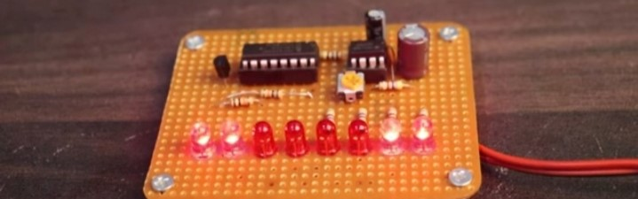

#  Knight Rider Lights - (DLD Project)

  

## Project Name:- 
                                                          LED Knight Rider
## Components

List of components which are used in project are:
-  1 X 555 Timer IC
-  1 x CD4094 IC                           
-  1 x BC547 TRANSISTOR                     
-  8 X LED                                  
-  1 X 100 Ohm Resistor                     
-  4 X 470 Ohm Resistors                   
-  1 X 4.7K Resistor                        
-  2 X 10K Resistors
-  1 x 10K TRIMPOT                          
-  JUMPER WIRES                             
-  1 X 100nF Capacitor                      
-  1 X 10uF CAPACITOR                       
-  1 X 100uF CAPACITOR                      
-  1 X PERF BOARD                           

Sure, here's a well-designed bullet-point format for your README.md file:

### Problem Statement
- LED Knight Rider lights may not function properly or produce the desired visual effect.
  - Lights may fail to sequence in the correct pattern.
  - Lights may blink or change colors inconsistently.
  - Limited range of motion.
- Results in a less-than-optimal user experience.
  - Frustrating and disappointing for users.
- Complexity of wiring and programming poses a challenge.
- Requires careful consideration of design, construction, and programming to ensure proper functionality and visual appeal.
***

### Introduction and Background
- LED Knight Rider Lights:
  - Type of automotive lighting creating a unique and stylish visual effect.
  - Popularized by the 1980s TV series "Knight Rider" featuring the car KITT.
- Popular aftermarket modification for cars, trucks, and motorcycles.
  - Installed on the front or rear of the vehicle.
  - Consists of a series of LED lights illuminating in a sequential pattern.
  - Creates a striking visual effect resembling a moving bar of light.
- LED technology advantages:
  - More energy-efficient, durable, and versatile.
  - Customizable color and pattern.
- Symbol of style and a must-have for car enthusiasts.

### Literature Review
- Knight Rider light sequence:
  - LEDs light up in a specific pattern to create a visual effect.
- Various approaches:
  - Microcontrollers and programming languages.
  - Hardware-based solutions.
- Popular approach:
  - Arduino microcontroller to control LED lights.
  - Programmed using languages like C or C++.
  - Specialized LED driver circuits (e.g., 4017 or 4094 decade counter).

### Proposed Approach
- Use an Arduino microcontroller to control LED lights.
  - Programmed using Arduino IDE.
  - Simplifies writing and uploading code to the microcontroller.
- LED lights connected to digital output pins of the Arduino.
  - Simple loop to control the light sequence.
  - Iterates over pins, turning on each LED in turn.
  - Short delay between each step to create the desired visual effect.
- Enhance effect with a potentiometer.
  - Adjusts the speed of the light sequence.
  - Allows user customization for visual appeal.
- Simple and cost-effective approach.
  - Suitable for various applications (decorative lighting, automotive lighting).

### Project Deliverables and Specifications
- **4094 IC:**
  - 4017 IC can also be used for Knight Rider.
  - The 4094 is an 8-bit register, capable of storing 8 bits of data.
  - It is a serial shift register, meaning each bit is shifted in one at a time until all bits are shifted in.
  - In contrast, a parallel shift register shifts in all 8 bits simultaneously.
- **11 LED Knight Rider Circuit:**
  - Can chase 11 LEDs in a reverse forward manner.
  - Creates beautiful LED effects suitable for decoration at home, parties, etc.
  - Can also be used in cars or bikes.

### Results and Discussion
- **LED Knight Rider Lights:**
  - Popular lighting effect featuring a series of LEDs that light up in a pattern mimicking the scanning motion of the Knight Rider car.
  - Results in a dynamic and eye-catching display suitable for various applications.
- **Technical Specifications:**
  - Typically consists of 10 to 12 LEDs wired together in a specific pattern.
  - LEDs are high-intensity, low-power devices designed to emit bright and consistent light over a long period.
  - Wiring pattern is carefully designed to create the desired scanning effect, controllable via a microcontroller or other programmable device.
- **Benefits:**
  - Versatile for a wide range of applications (automotive lighting, stage and event lighting).
  - Highly efficient and long-lasting, requiring minimal maintenance.
- **Discussion Points:**
  - **Quality of LEDs:**
    - Important to choose high-quality LEDs designed for the specific application.
    - Ensures consistent and reliable lighting effect and longevity of LEDs.
  - **Wiring Pattern:**
    - Critical for achieving the desired scanning effect.
    - Must follow a well-designed pattern and ensure neat and organized wiring to avoid connectivity or performance issues.
  - **Control System:**
    - Ranges from simple on/off switches to sophisticated microcontrollers.
    - Choice depends on the specific application and required level of control.

- **Conclusion:**
  - LED Knight Rider lights are versatile and eye-catching, suitable for a wide range of applications.
  - By choosing high-quality LEDs, following a well-designed wiring pattern, and selecting the right control system, a dynamic and reliable lighting effect can be created to impress and delight audiences.

***
### Writer : Muhammad Bilal Ashiq 

 

  
  
    
    
  

